Install SEED VM on VirtualBox
-----------------------------------

## Account Information of this VM

- User name: `seed`
- Password: `dees`

## Preparation

Before installing the SEED VM, please do the following:

- Install the free [VirtualBox](https://www.virtualbox.org/) software first.
  - The VM has been tested on Version `7.x`.
  - VirtualBox is a general-purpose full virtualizer for x86 hardware, targeted at server, desktop and embedded use. User Manual can be found [here](https://www.virtualbox.org/manual/).

- Download the zip file `SEED-Ubuntu20.04.zip` from the
[Google Drive](https://drive.google.com/file/d/138fqx0F8bThLm9ka8cnuxmrD6irtz_4m/view?usp=sharing) or [DigitalOcean](https://seed.nyc3.cdn.digitaloceanspaces.com/SEED-Ubuntu20.04.zip), unzip it,
and you will get a `.vdi` file. This file contains the pre-built SEED
Ubuntu 20.04 image. This document shows how to build a virtual machine
using this image.

## Step 1: Create a New VM in VirtualBox

We need to use `New` to create a new virtual machine.

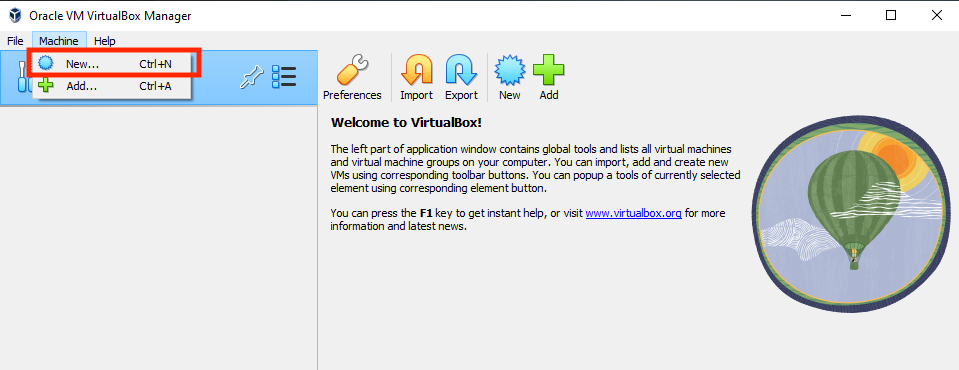

## Step 2: Provide a Name and Select the OS Type and Version

Our prebuilt Ubuntu 20.04 VM is 64-bit, so pick Ubuntu (64-bit).

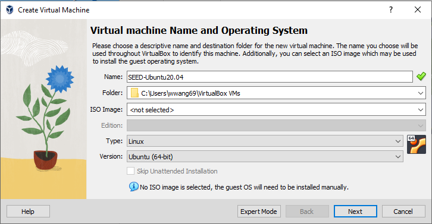


## Step 3: Set the Memory Size

We need to allocate dedicated memory for the VM.
1024 MB should be sufficient, but we recommend 2GB. If your computer has more
RAM, you can increase accordingly. The more memory you give to the VM,
the better the performance you will get.


## Step 4: Select the Pre-built VM File Provided by Us

Click the folder image. On the popup window, use
the `Add` button to select the `.vdi` file downloaded
from the SEED website.  


**Note**: If you get an error message saying that the UUID already exists,
this is because the UUID in the selected `vdi` file is the same as the
one used by an existing VM. You can either remove the other VM or
[change the UUID](https://tecadmin.net/change-the-uuid-of-virtual-disk/)
in the `vdi` file.

## Step 5: Configure the VM

After the previous step, your VM will be created, and you will
see it on VirtualBox's VM panel. We need to do some further
configuration. Right-click the M, click
the `Settings` option, and we will see the Settings window.

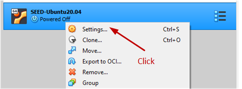


### Step 5.a: Enable Copy and Paste

Go to the `General` category, and select the `Advanced` tab.
Select `Bidirectional` for both items. The first item allows users to copy
and paste between the VM and the host computer
The second item allows users
to transfer files between the VM and the host computer using Drag'n Drop (this
feature is not always reliable).

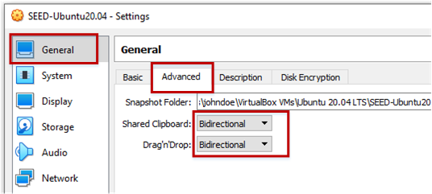

The copy-and-paste feature is very useful. If you can't do copy and paste,
chances are that you forgot to do this step. You can always do it later
by selecting the `Devices` menu item, and you will see the
`Shared Clipboard` submenu.


### Step 5.b: CPUs

Go to the `System` category, and select the `Processor` tab.
Assign number of CPUs to this VM if you prefer. Although may be sufficient,
if the performance seems to be an issue, increase the number.

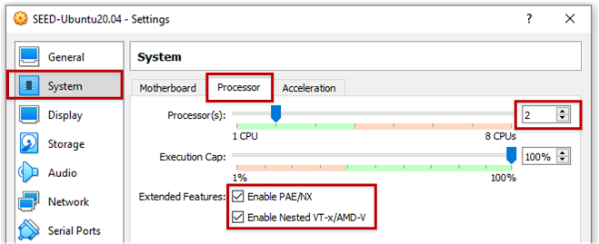


### Step 5.c: Display

Go to the `Display` category, and select the `Screen` tab. If the
display does not seem to work properly, try to increase the amount of video memory.
In our testing, `58 MB` seems to be sufficient. (Low video memory may cause a black
screen error on VirtualBox. )

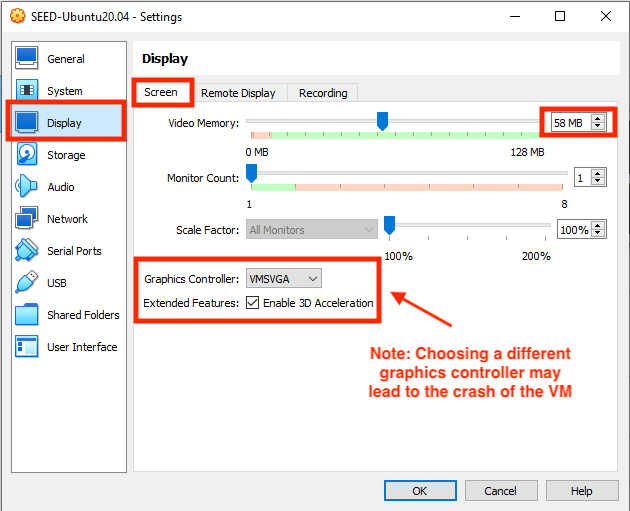

**Note 1**: Make sure to select `VMSVGA`, as choosing other graphic controllers
may lead to the crash of the VM.

**Note 2**: If your computer's screen resolution is too high, the VM may not be able
to match the high resolution. As results, your VM will be very small on your screen.
To make it bigger, adjust the `Scale Factor` in this setting.

### Step 5.d: Network

<!-- Go to the `Network` category, and select the `Adapter 1` tab. We will
choose the `NAT Network` adaptor. Click the `Advanced` drop-down menu to
further configure the network adaptor. If you don't see such an adaptor,
see the note below.-->

Go to the `Network` category, and select the `Adapter 1` tab. We will
choose the `NAT` adaptor.
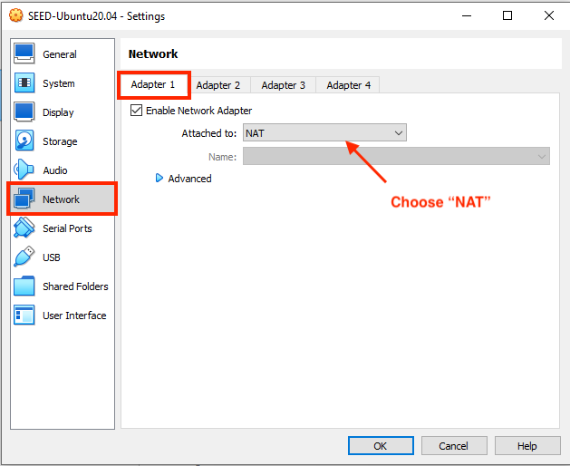


<!-- **Note**: If you don't see the `NAT Network` adaptor, you need to create one.
Go to the `File` menu, click `Preferences...`. You will see a popup window.
Go to the `Network` tab, and you can add a new `Nat Network` adaptor there.-->

## Appendix A: Start the VM and Take Snapshot

We can now start the VM. You can also use the `Take` button to take a snapshot
of your VM. This way, if something goes wrong, you can roll back the state of
your VM using the saved snapshots.


## Appendix B: Stop the VM

There are many ways to stop the VM. The best way is to use the `Save State`. This
is different from shutting down the VM. It saves the current VM state, so next time
when you restart the VM, the state will be recovered. Moreover, the speed is also
faster than booting up a VM.


## Appendix C: Creating a Shared Folder

Sometimes, we need to copy files between the host machine and the VM.
If you are using the VM from the cloud, you can see our cloud VM manual
for instructions. Or, you can just use a cloud storage service, such as
Dropbox and Google Drive to share files between your VM and host machine.

If you run the VM on your local computer, you can create a shared folder
between your computer and the VM. We recommend you turn off the VM before you do
Step A. Change the setting while the VM is running may crash the VM.

**Step A.** First you need to create a folder on your local computer (or using
an existing folder). We will let the VirtualBox know that this folder
should be shared with the VM. Go to the following menus:

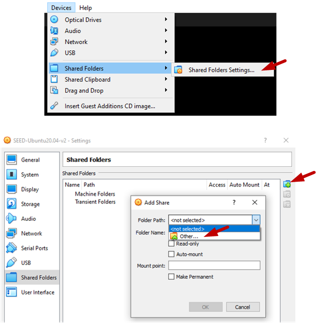

Once you see a `Add Share` popup window, select the folder that
you want to share, click OK, and you will see that the folder is now
made available for sharing.

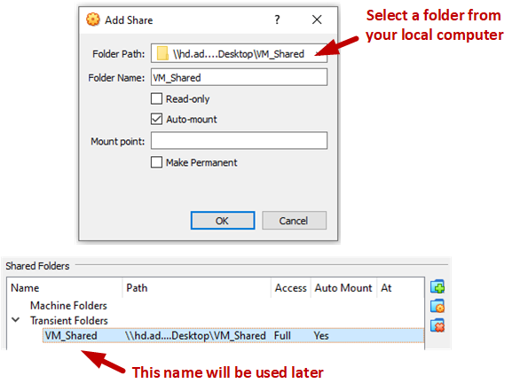

**Step B.** Inside the VM, we need to mount the shared folder somewhere.
Let's mount it to the home directory as a folder `Share`.
We will create a folder called `Share` in the home directory, and then
mount the shared folder `VM_Shared` to this `Share` folder using
the following command. After that, you can access the shared folder
from `~/Share`.

```
$ mkdir -p ~/Share
$ sudo mount -t vboxsf VM_Shared ~/Share
```

Nowadays, an issue -- On some latest version VirtualBox, the folder `VM_Shared` doesn't mount on `~/Share` anymore after restart the VM --  is reported. To solve this issue, we can create an auto-mount script under `/etc/profile.d` folder.
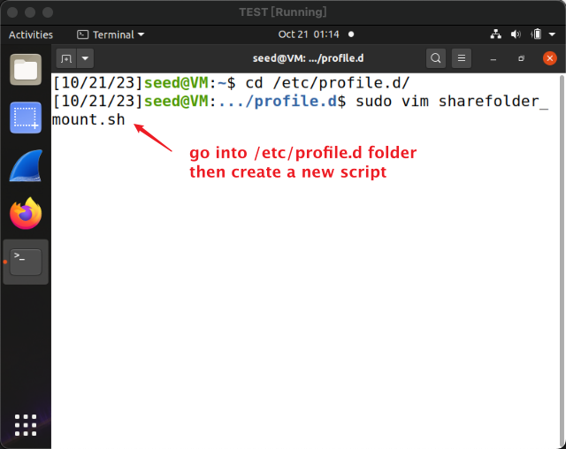

Inside the script file, input the mount command we want to run when system initialized and save the file.
```
sudo mount -t vboxsf VM_Shared ~/Share
```

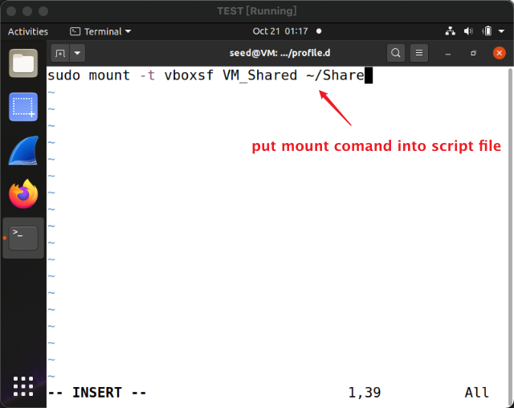

Once VM is started, all scripts under `/etc/profile.d` folder will be executed. So system automatically mount the shared folder `VM_Shared` to this `Share` folder.


**Important Note.** Please only use the shared folder to copy files
between the VM and the host machine, and **never use it
as your working folder**. Working from the shared folder has
caused many problems, especially on the permissions of the files
created inside the shared folder. For example, if we unzip
the `Labsetup.zip` file inside the shared folder, the permissions
of the unzipped files will be different from those on
the original files. Some labs and containers are very
sensitive to those permissions.